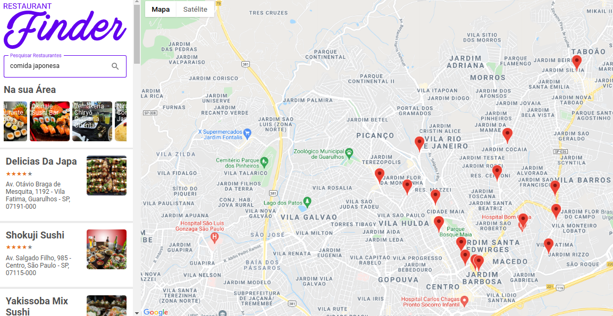

# Restaurant-Finder

#### Projeto feito com ReactJs, Redux, Api Google maps e alguns frameworks 

O projeto consiste em um sistema de busca de restaurantes, para ajudar o usuário encontrar restaurantes próximos, o usuário pode pesquisar por tipo de comida.

Selecionando o restaurante obtém as informações necessárias como endereço, telefone e horário de funcionamento.

Projeto feito pelo Bootcamp da Digital Innovation junto com a Localiza Labs ministrado pelo Professor Patrick Narciso
https://www.linkedin.com/in/patricknarciso/